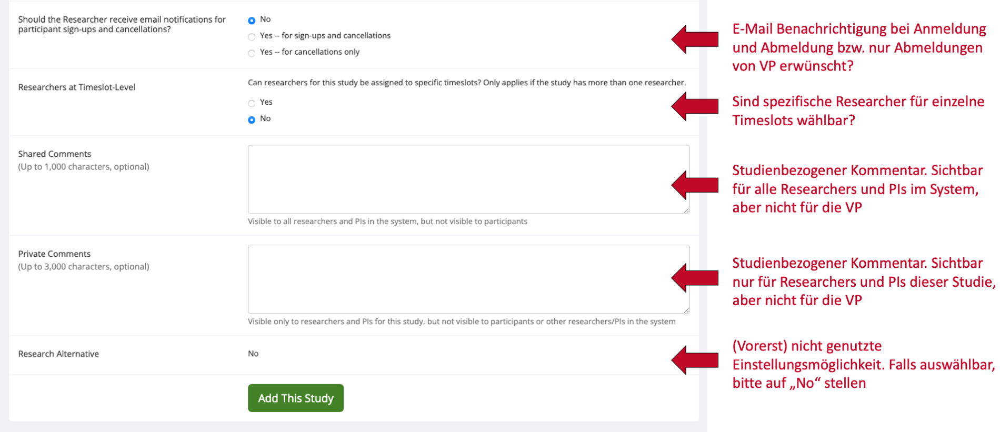
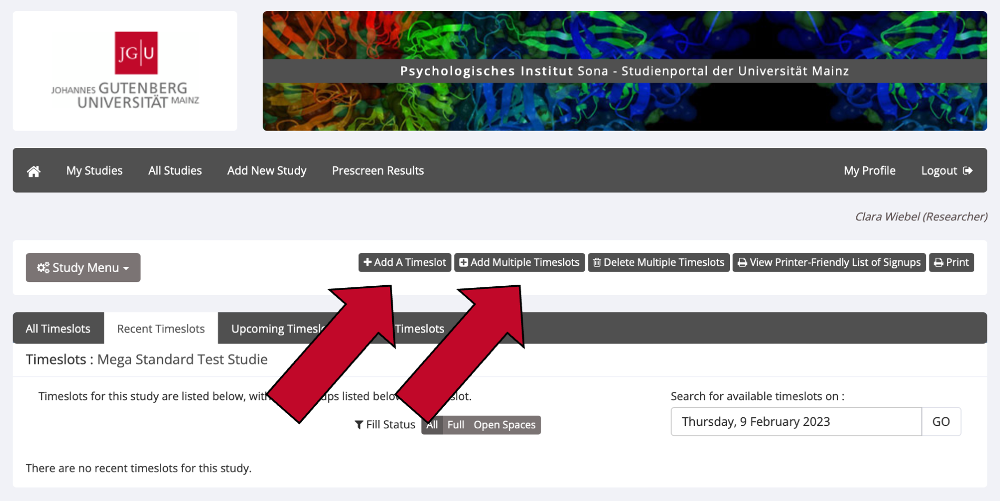
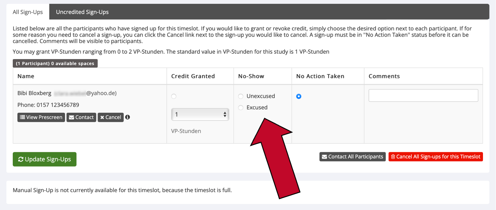
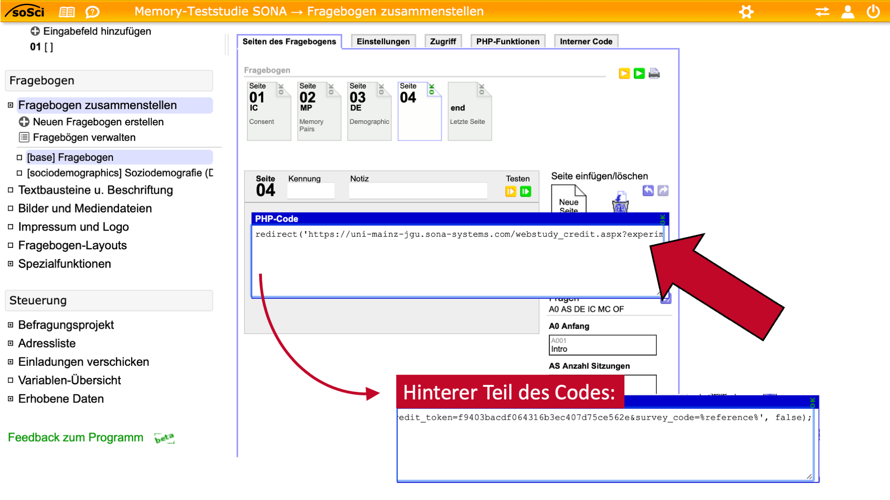

--- 
title: "Sona Researcher Handbuch"
author: "Clara Wiebel, José Carlos García Alanis"
date: "`r Sys.Date()`"
site: bookdown::bookdown_site
documentclass: book
bibliography: [packages.bib]
url: https://amd-lab.github.io/sona-researcher-jgu/index.html
# cover-image: path to the social sharing image like images/cover.jpg
description: "Dies ist das Researcher-Handbuch für Sona Systems des psychologischen Instituts der JGU Mainz"
link-citations: yes
github-repo:  AMD-Lab/sona-researcher-jgu
lang: de
---

```{r include=FALSE}
options(width = 60)
options(warning.length = 100)
```

# Allgemeine Informationen

Dies ist das Sona-Handbuch für Forscher*innen. Das Sona-Handbuch für Versuchspersonen finden Sie unter dieser Adresse:

- https://amd-lab.github.io/sona-participants-jgu/

Die Sona-Website der Johannes Gutenberg-Universität Mainz finden Sie unter dieser Adresse:

- https://uni-mainz-jgu.sona-systems.com


## Was ist Sona und welche Vorteile bietet es?

**Sona Systems** ist ein Onlineportal, das Forscher\*innen in der Verwaltung von wissenschaftlichen Studien und deren Teilnehmer\*innen unterstützt. Forscher\*innen können über Sona Versuchspersonen rekrutieren, Zeitfenster („Timeslots“) für Studien einstellen und die Teilnahme an Studien mit Versuchspersonen-Stunden (VP-Stunden) vergüten. Dies ist über den Webbrowser oder die Sona App (eingeschränkte Nutzungsfunktionen) möglich. Sie können in Sona Systems sowohl Online-Studien als auch Laborstudien verwalten. Beide Studienformen können zudem als mehrteilige Studien angelegt werden.

Sona bietet direkten Zugang zu einem großen Pool an möglichen Versuchspersonen. In diesem Pool befinden sich alle Psychologiestudierenden, die derzeit Versuchspersonen-Stunden erwerben müssen, aber auch Studierende andere Fächer und Personen mit einer anderen beruflichen Tätigkeit. Die Versuchspersonen für Ihre Studie können bei Bedarf vorselektiert („gescreent“) werden.

Sona Systems verringert den Arbeitsaufwand erheblich, den Forscher*innen bislang mit der Organisation von Studienterminen und der Vergabe von VP-Stunden per E-Mail hatten. Diese können in Sona Systems nun mit nur einem Mausklick vergeben werden. 


## Wer kann einen Forschenden-Account erhalten?

Alle Mitarbeiter\*innen des Psychologischen Instituts der Johannes-Gutenberg-Universität Mainz können einen Forschenden-Account („Researcher Account“) erhalten. Wissenschaftliche Hilfskräfte sind auch Angehörige des psychologischen Instituts und können somit ebenfalls einen Forschenden-Account erhalten. Studierende erhalten grundsätzlich keine Forschenden-Accounts für experimentelle Praktika oder ähnliche Lehrveranstaltungen. Ob Studierende für die Verwaltung ihrer Abschlussarbeit einen eigenen Forschenden-Account erhalten oder z.B. stattdessen die Zugangsdaten zu einem gemeinsamen Funktionsaccount für alle Abschlussarbeiten, wird von den Abteilungen intern geregelt. Für die Verwaltung der Abschlussarbeit und ggf. die Vergabe von Versuchspersonen-Stunden (VP-Stunden) ist der\*die jeweilige Betreuer\*in der Abschlussarbeit verantwortlich.


## Wie kann ich meinen Forschenden-Account erhalten?

Nur die Administration kann Forschenden-Accounts in Sona Systems erstellen und verwalten. Falls Sie ein Anrecht auf einen Forschenden-Account haben (sehen Sie hierzu [Wer kann einen Forschenden-Account erhalten?]), wenden Sie sich bitte unter [sona@uni-mainz.de](mailto:sona@uni-mainz.de?subject=Frage zu Sona - Researcher) an die Administration. Geben Sie in der E-Mail bitte...

1. Ihren **Namen**, 
2. Ihre **E-Mail-Adresse der Universität Mainz** sowie 
3. Ihre **Rolle an der Universität** (Professor\*in, Postdoc, Doktorand\*in, 
wissenschaftliche Hilfskraft o. Ä.) an. 

Sie erhalten innerhalb der nächsten Tage eine E-Mail von Sona mit Ihren Login-Informationen. Geben Sie auf der Sona Startseite (https://uni-mainz-jgu.sona-systems.com) unter "User ID" bitte Ihren Benutzernamen und unter "Password" das vom System generierte Passwort ein. Sobald Sie sich das erste Mal eingeloggt haben, können Sie auch den Knopf "JGU-Account Log In" auf der Sona Startseite verwenden, um sich direkt über Ihre Universitäts-E-Mail-Adresse einzuloggen. Falls Sie nicht den Log-In über Ihren JGU-Account nutzen möchten, sollten Sie Ihr Passwort zu einem sichereren Passwort ändern. 


## Rollen im System

In Sona gibt es zwei Rollen für Foscher\*innen – Researcher und Principal Investigator (P.I.). Dieses Handbuch gilt für beide Rollen und nutzt deshalb den Sammelbegriff „Forschende“ für beide Rollen. Für jede Studie in Sona muss mindestens ein Researcher und genau ein P.I. ausgewählt werden. Dabei ist der Researcher für die Datenerhebung (insbesondere im Labor) und die Kommunikation mit den Versuchspersonen zuständig, während der P.I. die Rolle des\*der Projektleiter\*in einnimmt (in der Regel Professor\*innen). 

P.I.s können bei einer Studie prinzipiell dieselben Funktionen ausführen wie ein Researcher. Der Hauptunterschied zwischen einem P.I.- und einem Researcher-Konto besteht darin, dass Researcher die Möglichkeit haben, Routine-E-Mails vom System über ihre Studie zu erhalten. Dies sind z.B. Benachrichtigungen, wenn sich Versuchspersonen für die Studie anmelden oder abmelden. Der\*die P.I. hat keine Möglichkeit, solche E-Mails zu erhalten. Er ist allerdings dafür zuständig, die Studie final zu genehmigen, damit sie den Versuchsperonen auf Sona angezeigt wird. 


## Kann ich die Website auch auf Deutsch sehen?

Nein, für Forscher\*innen ist die Website leider nur auf Englisch verfügbar. Für die Versuchspersonen ist die Website allerdings auf Deutsch und wahlweise Englisch verfügbar. 


# Studien einstellen und verwalten

## Studien einstellen

Sona Systems unterscheidet fünf Arten von Studien, wobei jede Art entweder mit VP-Stunden („Credit“) oder mit einer Bezahlung („Paid“; auch Gutscheine o.Ä. möglich) vergütet werden kann. Studien, in denen Teilnehmer\*innen zwischen VP-Stunden und Bezahlung wählen können, werden als „Credit“-Studie angelegt. Die alternative Aufwandsentschädigung wird dann in der Beschreibung der Studie erwähnt. 

-	**Standard Study:** Normale Laborstudie (nicht online)
-	**Multi-Part Standard Study:** Normale Laborstudie (nicht online), die aus mindestens zwei Teilen besteht
-	**Online External Study:** Online-Studie, die auf einer anderen Website durchgeführt wird als Sona (z.B. SoSci Survey, Open-Lab usw.). Dies ist bei den meisten Online-Studien der Fall. **Tipp:** Für Online-Studien ist es möglich, automatisiert VP-Stunden zu vergeben, sobald eine Versuchsperson die letzte Seite Ihres Experiments oder Fragebogens erreicht hat. Lesen Sie den Abschnitt [Wie vergebe ich VP-Stunden für Online-Studien?] für eine Anleitung zur Implementierung in SoSci Survey.
-	**Multi-Part Online External Study:** Online-Studie, die auf einer anderen Website durchgeführt wird als Sona und mehrere Messzeitpunkte hat
-	**Online Internal Survey Study:** Online-Befragung innerhalb von Sona 

<br>
Um Ihre Studie auf Sona einzustellen, gehen Sie folgendermaßen vor.

1.	Loggen Sie sich mit Ihrem Forschenden-Account auf https://uni-mainz-jgu.sona-systems.com ein.
2.	Wählen Sie entweder `Add New Study` im Menüstreifen oder `+ Create a new Study`.

```{r echo = FALSE, out.width='92%', fig.align='center'}
knitr::include_graphics('images/Folie10.png')
```

3.	Wählen Sie die passende Art von Studie aus und klicken sie auf `Continue`.
4.	Nun geben Sie alle Informationen zu Ihrer Studie ein. Die genauen Erklärungen für die Eingabefelder sind in den folgenden Screenshots aufgeführt. 
5.	Speichern Sie Ihre Eingabe, indem Sie auf den grünen Knopf `Add this Study` klicken. Die Studie wird den Versuchspersonen nur angezeigt, wenn sie sowohl „active“ als auch „approved“ ist. Sie können die Studie selbst auf „active“ setzen ([Studie auf „active“ setzen]), aber nur der Principal Investigator (P.I.) Ihrer Studie und die Administration können die Studie genehmigen ([Studie genehmigen lassen ("approve")]).


```{r echo = FALSE, out.width='92%', fig.align='center'}
knitr::include_graphics('images/Folie11.png')
```
```{r echo = FALSE, out.width='92%', fig.align='center'}
knitr::include_graphics('images/Folie12.png')
```
```{r echo = FALSE, out.width='92%', fig.align='center'}
knitr::include_graphics('images/Folie13.png')
```
```{r echo = FALSE, out.width='92%', fig.align='center'}
knitr::include_graphics('images/Folie14.png')
```
```{r echo = FALSE, out.width='92%', fig.align='center'}

```


## Studie auf „active“ setzen

Bitte beachten Sie: Bevor Sie Ihre Studie auf „active“ setzen, sollten Sie die ersten Timeslots für Versuchspersonen eingerichtet haben. Ansonsten kann es passieren, dass die Versuchspersonen Ihre Studie auf Sona sehen, sich aber nicht dafür anmelden können. 

1.	Loggen Sie sich mit Ihrem Forschenden-Account auf https://uni-mainz-jgu.sona-systems.com ein.
2.	Klicken Sie in der Menüleiste auf `My Studies` und klicken Sie auf den Titel der betreffenden Studie.
3.	Wählen Sie im `Study Menu` (entweder oben oder ganz unten auf der Website) den Unterpunkt `Change Study Information` aus.
4.  Klicken Sie unter `Active Study?` auf „Yes“, um Ihre Studie auf aktiv zu setzen. 
5.	Klicken Sie auf den grünen Knopf `Save Changes`, um Ihre Änderungen zu speichern.


## Studie genehmigen lassen ("approve")

Nur der Principal Investigator (P.I.) Ihrer Studie kann diese genehmigen (auf "approved" setzen). Sobald Sie einige Timeslots eingestellt und Ihre Studie auf "active" gesetzt haben ([Studie auf „active“ setzen]), sollten Sie Ihren P.I. bitten, Ihre Studie zu genegmigen. 

Falls Ihr P.I. nicht verfügbar ist, kann Ihre Studie auch durch die Administration genehmigt werden. Klicken Sie dafür unter `Change Study Information` Ihrer Studie im Abschnitt `Approved?` auf den Knopf `Send an Approval Request`, um eine Genehmigung durch die Administration zu beantragen. Diese wird an Werktagen normalerweise innerhalb der nächsten 48 Stunden vorgenommen. Sollten Sie länger als 48 Stunden keine Rückmeldung zu Ihrer Studie erhalten haben, schreiben Sie bitte eine E-Mail an die Administration (sona@uni-mainz.de), dass Sie auf die Genehmigung Ihrer Studie warten.

<br>
<b>So genehmigen Sie eine Studie, wenn Sie der P.I. sind: </b>


1.	Loggen Sie sich mit Ihrem PI-Account auf https://uni-mainz-jgu.sona-systems.com ein.
2.	Klicken Sie in der Menüleiste auf `My Studies` und klicken Sie auf den Titel der betreffenden Studie.
3.	Wählen Sie im `Study Menu` (entweder oben oder ganz unten auf der Website) den Unterpunkt `Change Study Information` aus.
4.  Klicken Sie unter `Approved?` auf "Yes". 
5.	Klicken Sie auf den grünen Knopf `Save Changes`, um Ihre Änderungen zu speichern.


## Warum ist eine Genehmigung meiner Studie durch den P.I. oder die Administration notwendig?

Die Genehmigung Ihrer Studie ist eine Vorsichtsmaßnahme, damit den Versuchspersonen auf Sona nicht versehentlich Studien angezeigt werden, die noch nicht fertig eingestellt sind. Zudem sollte bei der Genehmigung geprüft werden, ob die grundlegenden Regeln von Sona (z.B. faire Vergabe von VP-Stunden, ausreichende Informationen zur Studie) eingehalten werden. 


## Wie nutze ich die Pre-Screen Funktion?

Mit der Pre-Screening Funktion können Sie Versuchspersonen anhand bestimmter Kriterien für die Teilnahme an Ihrer Studie vorselektieren. Versuchspersonen, die nicht für Ihre Studie qualifiziert sind, sehen Ihre Studie gar nicht erst in der Liste der für sie verfügbaren Studien. Das Ausfüllen des Pre-Screening Fragebogens ist für alle Versuchspersonen auf Sona freiwillig.

1.	Um die Pre-Screen Funktion zu nutzen, müssen Sie zunächst Ihre Studie erstellen. Sehen Sie dazu den Abschnitt [Studien einstellen].
2.	Sobald Sie Ihre Studie eingestellt haben, gehen Sie auf die Detailansicht Ihrer Studie (dafür den Namen der Studie unter `My Studies` anklicken).
3.	Klicken Sie oben rechts auf den Knopf `View/Modify Restrictions` 

```{r echo = FALSE, out.width='92%', fig.align='center'}
knitr::include_graphics('images/Folie16.png')
```

4.	Hier sehen Sie alle Pre-Screening Fragen, anhand denen Sie Versuchspersonen vorselektieren können. Klicken Sie nur diejenigen Fragen an, anhand derer Sie Versuchspersonen für Ihre Studie vorselektieren möchten. Klicken danach Sie auf `Set Restrictions`.
5.	Nun können Sie diejenige Antwort auswählen, die Versuchspersonen gewählt haben müssen, um für Ihre Studie zugelassen zu werden. Um sich für die Teilnahme an Ihrer Studie zu qualifizieren, müssen die Teilnehmer für jede Frage eine der von Ihnen ausgewählten Antworten gewählt haben.
6.	Klicken Sie auf `Save Changes`, um Ihre Eingabe zu speichern. Die Vorselektion der Versuchspersonen ist ab diesem Moment aktiv. 


## Timeslots für Studien erstellen und verwalten

Timeslots (Zeitfenster) sind die verfügbaren Zeiten, zu denen eine Versuchsperson an Ihrer Studie teilnehmen kann. Mit Zeitfenstern können Sie ein Datum, eine Uhrzeit, einen Ort, eine maximale Teilnehmerzahl und eine\*n (oder mehrere) Forscher\*innen für eine Sitzung angeben. 

<br>
<b>Timeslots für Laborstudien erstellen</b>

1.	Klicken Sie im Hauptmenü auf `My Studies` und dann auf den Titel Ihrer Studie.
2.	Wählen Sie im Study Menu (ganz oben und ganz unten auf der Seite) den Punkt `View/Administer Time Slots`. 
3.	Klicken Sie oben links auf `Add A Timeslot` oder `Add multiple Timeslots`.

```{r echo = FALSE, out.width='92%', fig.align='center'}

```

4.	Füllen Sie alle Felder aus. 
5.	Klicken Sie am Ende auf `Add`, um Ihren Timeslot anzulegen.

Falls Sie die Timeslots aus einer bestimmten Woche kopieren möchten, klicken Sie auf `Add Multiple Timeslots` und scrollen Sie ganz nach unten. Hier können Sie die Timeslots aus einer von Ihnen gewählten Woche in eine neue Woche kopieren.

<br>
<b>Timeslots für Online-Studien erstellen</b>

Wenn Sie eine Online-Studie durchführen, sollten Sie nur einen einzigen Timeslot erstellen. Treffen Sie bei der Erstellung des einen Timeslots folgende Einstellungen:

*	Final Participation Date: Der Tag, bis zu dem Versuchspersonen an Ihrer Studie teilnehmen können 
*	Final Participation Time: Die Uhrzeit, bis zu der Versuchspersonen am letzten Tag an Ihrer Studie teilnehmen können.
*	Max. Number of Participants: Maximale Anzahl an Versuchspersonen, die sich für Ihre Studie anmelden können (maximal 999). 

<br>
<b>Timeslots für eine Studie ändern oder löschen</b>

1.	Klicken Sie im Hauptmenü auf `My Studies` und dann auf den Titel Ihrer Studie.
2.	Wählen Sie im Study Menu (ganz oben und ganz unten auf der Seite) den Punkt `View/Administer Time Slots`. 
3.	Sie sehen nun eine Liste der aktuellen Timeslots. Timeslots, die in der Vergangenheit liegen und für die sich keine Teilnehmer\*innen angemeldet haben, werden nicht angezeigt.


```{r echo = FALSE, out.width='92%', fig.align='center'}
knitr::include_graphics('images/Folie18.png') 
```


4.	Klicken Sie für den Timeslot, den Sie ändern oder löschen möchten, rechts auf `Modify`.
    a. <b>Ändern:</b> Ändern Sie die gewünschten Informationen und klicken Sie auf den Knopf `Update Timeslot`. Achtung: Bereits für diesen Timeslot angemeldete Versuchspersonen werden nicht automatisch über die von Ihnen vorgenommenen Änderungen benachrichtigt. Sie sollten sich daher mit den angemeldeten Versuchspersonen in Verbindung setzen, wenn Sie sie über Ihre Änderungen informieren möchten (sehen Sie hierzu den Abschnitt [Angemeldete Versuchspersonen kontaktieren]).
    b. <b>Löschen:</b> Sie können keine Timeslots löschen, für die sich bereits Versuchspersonen angemeldet haben. Dafür müssen Sie zuerst alle bestehenden Anmeldungen für diese Timeslots stornieren (sehen Sie hierzu den Abschnitt [Termine absagen / Versuchspersonen abmelden] in diesem Handbuch). Klicken Sie danach auf den Knopf `Delete` und bestätigen Sie Ihre Eingabe erneut, um den Timeslot zu löschen.


## Studieninformationen ändern

Sie können jederzeit Informationen über Ihrer Studie aktualisieren. Bitte beachten Sie, dass einige Informationen je nach Status der Studie nicht mehr veränderbar sind (z.B. wenn sich bereits Versuchspersonen angemeldet haben) oder eine erneuten Genehmigung („approve“) der Studie durch Ihren P.I. oder die Administration erfordern.

1.	Loggen Sie sich mit Ihrem Forschenden-Account auf https://uni-mainz-jgu.sona-systems.com ein.
2.	Klicken Sie auf `My Studies` und klicken Sie auf den Titel derjenigen Studie, die sie ändern wollen.
3.	Wählen Sie im `Study Menu` (entweder oben oder ganz unten auf der Website) den Unterpunkt `Change Study Information` aus.
4.	Machen Sie die gewünschten Änderungen und klicken Sie auf den grünen Knopf `Save Changes`, um Ihre Änderungen zu speichern. Falls Sie Informationen in Ihrer Studie ändern, die eine erneute Genehmigung Ihrer Studie erfordern (beispielsweise die Anzahl an vergebenen VP-Stunden), gehen Sie genauso vor wie bei der ersten Genehmigung ([Studie genehmigen lassen ("approve")]). 


## Studien deaktivieren oder löschen 

<b>Studie deaktivieren</b>

Sie können Ihre Studie auf „inactive“ setzen, sobald sich keine weiteren Versuchspersonen mehr für Ihre Studie anmelden sollen. Bitte deaktivieren Sie Ihre Studien, sobald Ihre Datenerhebung abgeschlossen ist.

1.	Gehen Sie in die Detailansicht der Studie (Namen der Studie anklicken).
2.	Wählen Sie unter „Study Menu“ (entweder oben oder ganz unten auf der Seite) den Unterpunkt `Change Study Information` aus. 
3.	Wählen Sie im Abschnitt `Active Study?` „No“ aus und bestätigen Sie die Änderung mit dem grünen Knopf `Save Changes`.

<br>
<b>Studie löschen</b>

Eine Studie kann nur gelöscht werden, wenn ...

*	Keine Versuchspersonen mehr dafür angemeldet sind und ...
*	bisher keine VP-Stunden für die Studie vergeben wurden. Grund dafür: Um im System die geleisteten Versuchspersonenstunden der Studierenden zu verwalten, müssen alle Studien, die dazu beigetragen haben, intakt bleiben. Daher sollten Studien, die mit VP-Stunden vergütet wurden, nicht gelöscht werden, sondern auf „inactive“ gesetzt werden!

1.	Gehen Sie in die Detailansicht der Studie (Namen der Studie anklicken).
2.	Wählen Sie unter „Study Menu“ (entweder oben oder ganz unten auf der Seite) den Unterpunkt `Delete Study` aus. Wenn Sie diesen Unterpunkt nicht in der Menüleiste sehen, sind entweder noch Versuchspersonen für diese Studie angemeldet oder es wurden für diese Studie bereits VP-Stunden vergeben. 
3.	Sie werden nun zu den Einstellungen der Studie weitergeleitet. Scrollen Sie nach unten und klicken Sie auf den roten Knopf `Yes. Delete`. Danach ist Ihre Studie endgültig gelöscht.


## Wie darf ich für die Teilnahme an meiner Studie werben?

Sona versendet einmal wöchentlich eine automatische E-Mail an Versuchspersonen, in der alle Studien aufgelistet sind, die aktuell für sie in Sona zur Teilnahme verfügbar sind. Wenn Sie darüber hinaus für die Teilnahme an Ihrer Studie werben wollen, gibt es im ersten Stock des psychologischen Instituts in der Binger Straße 14-16 ein schwarzes Brett, an dem Werbung und Plakate für Studien angebracht werden können. Außerdem können Sie natürlich weiterhin über soziale Medien, lokale Zeitungen oder Flyer für die Teilnahme an Ihren Studien werben.

Auf Sona helfen oft ein kreativer Name sowie eine informative und originelle Beschreibung der Studie, um Teilnehmer\*innen auf Ihre Studie aufmerksam zu machen. Bitte verwenden Sie jedoch keine Sonderzeichen (!!!\*\*\*###) oder CAPSLOCK im Titel Ihrer Studie. Die angezeigte Reihenfolge der Studien wird bei jedem Login für die Versuchspersonen neu randomisiert.

Bitte sehen Sie ferner davon ab, Werbung für Ihre Studie über den E-Mail-Verteiler der Fachschaft zu senden. Dies ist nicht erwünscht, da der Verteiler fortan ausschließlich für Fachschafts-Inhalte genutzt wird. Eine Missachtung führt dazu, dass Ihre E-Mail-Adresse für den Verteiler blockiert wird. 


# Versuchspersonen verwalten


## Ab wann können sich Versuchspersonen für meine Studie anmelden?

Versuchspersonen können Ihre Studie erst in Sona sehen und sich für diese anmelden, wenn Ihre Studie sowohl „active“ als auch „approved“ ist. Sie können Ihre Studie selbst auf „active“ setzen ([Studie auf „active“ setzen]), die Studie genehmigen kann allerdings nur der P.I. Ihrer Studie sowie die Administration ([Studie genehmigen lassen ("approve")]).


## Versuchspersonen manuell anmelden

Für den Fall, dass Sie persönlich einen Termin mit einer Versuchsperson ausgemacht haben oder Versuchspersonen spontan zu Ihrer Erhebung erscheinen dürfen, können Sie diese Versuchspersonen manuell zur Studie anmelden. 

Dafür müssen zwei Voraussetzungen gegeben sein: (1) Die Versuchsperson, die Sie anmelden möchten, hat ein Sona Konto. (2) Es muss bereits einen freien Timeslot geben, zu dem Sie die Versuchsperson anmelden. Wenn Sie also einen offenen Erhebungszeitraum planen, stellen Sie vorher einen oder mehrere Timeslots für Ihre Studie ein mit jeweils so vielen Plätzen, wie Versuchspersonen gleichzeitig an Ihrer Studie teilnehmen können.

Um Versuchspersonen manuell für Ihre Studie anzumelden, gehen Sie wie folgt vor.


1.	Klicken Sie in der Menüleiste auf „My Studies“ und dann auf den Namen der betreffenden Studie.
2.	Wählen Sie im Study Menu (ganz oben und ganz unten auf der Seite) den Punkt `View/Admister Time Slots`. 
3.	Klicken Sie bei dem Timeslot, für den Sie die Versuchsperson anmelden wollen, rechts auf `Modify`.
4.	Ganz unten auf der Seite finden Sie den Abschnitt `Manual Sign-Up`. Hier können Sie entweder die User ID (Benutzername auf Sona) oder den vollen Namen der Versuchsperson eintragen.
5.	Klicken Sie auf den grünen Knopf `Sign Up`, um die Anmeldung abzuschließen und bestätigen Sie die Eingabe erneut mit `Sign Up`. 


## Wo sehe ich, wer sich für meine Studie(n) angemeldet hat? 

Sie erhalten immer eine System-E-Mail, sobald sich Versuchspersonen für Ihre Studie anmelden. Zudem können Sie am Vortag des Termins mit einer Versuchsperson eine Reminder-E-Mail erhalten. Ob Sie diese Reminder-E-Mail erhalten oder nicht, können Sie ganz unten unter `My Profile` ändern. 

Um eine Liste von Anmeldungen für Ihrer Studie zu erhalten, gehen Sie bitte wie folgt vor.

1.	Klicken Sie in der Menüleiste auf `My Studies`.
    * Alternative A: Klicken Sie auf `View Printer-Friendly List of Signups`, um eine Liste von Versuchspersonen zu erhalten, die an einem bestimmten Tag für irgendeine Ihrer Studien angemeldet sind.
    * Alternative B: Klicken Sie auf den Titel einer bestimmten Studie und wählen Sie im `Study Menu` (entweder oben oder ganz unten auf der Website) den Unterpunkt `View/Administer Time Slots` aus. Hier können Sie in der Menüleiste wählen, ob Sie 
        * alle Timeslots (`All Timeslots`), 
        * aktuelle Timeslots (`recent Timeslots`), 
        * anstehende Timeslots (`Upcoming Timeslots`) oder 
        * ältere Timeslots (`Older Timeslots`) sehen möchten. 


```{r echo = FALSE, out.width='92%', fig.align='center'}
knitr::include_graphics('images/Folie19.png') 
```


## Angemeldete Versuchspersonen kontaktieren

Sie haben zwei Möglichkeiten, um für Ihre Studie angemeldete Versuchspersonen zu kontaktieren: 

* Per E-Mail: Dies ist der Standard, um Versuchspersonen zu kontaktieren. Insbesondere wenn es um einen Termin geht, der nicht noch am selben Tag stattfinden soll, kontaktieren Sie die Versuchsperson bitte per E-Mail.
* Ggf. telefonisch: Bitte kontaktieren Sie Versuchspersonen nur in Notfällen telefonisch, beispielsweise wenn diese nicht zu ihrem angemeldeten Termin erscheinen, Sie selbst sich zum Termin verspäten oder den vereinbarten Termin sehr kurzfristig absagen müssen. Bitte beachten Sie, dass Versuchspersonen nicht dazu verpflichtet sind, ihre Handynummer auf Sona anzugeben, sodass Sie manche Versuchspersonen nicht telefonisch erreichen können. Kontaktieren die diese Versuchspersonen bitte per E-Mail.


<b>Kontaktierung per E-Mail </b>

1.	Klicken Sie in der Menüleiste auf `My Studies` und klicken Sie den Namen der betreffenden Studie an. 
2.	Wählen Sie im Study Menu (ganz oben und ganz unten auf der Seite) den Punkt `View/Admister Time Slots`. 
3.	Klicken Sie beim betreffenden Timeslot rechts auf `Modify`.
    a.	Klicken Sie unter dem Namen einer Versuchsperson auf `Contact`, um diese Person einzeln zu kontaktieren.
    b.	Oder: Klicken Sie ganz unten auf den grauen Knopf `Contact All Participants`, um alle für diesen Timeslot angemeldeten Versuchspersonen zu kontaktieren.

```{r echo = FALSE, out.width='92%', fig.align='center'}
knitr::include_graphics('images/Folie20.png') 
```


4.	Geben Sie im grauen Feld die E-Mail an die Versuchspersonen ein. Sie können den Standard-Text, der bereits eingefügt ist, löschen. Sie haben zudem die Möglichkeit, die E-Mail erst mit einer Zeitverzögerung vom System abschicken lassen. Dies können Sie unter `Emailing Delay` einstellen. 
5.	Klicken Sie auf `Preview Messages…`, um Ihre E-Mail zu überprüfen.
6.	Klicken Sie auf `Proceed`, um die E-Mail abzuschicken.


<b> Telefonische Kontaktierung </b>

1.	Klicken Sie in der Menüleiste auf `My Studies` und klicken Sie den Namen der betreffenden Studie an. 
2.	Wählen Sie im Study Menu (ganz oben und ganz unten auf der Seite) den Punkt `View/Admister Time Slots`. 
3.	Klicken Sie beim betreffenden Timeslot rechts auf `Modify`.
4.	Wenn die Versuchsperson Ihre Handynummer auf Sona angegeben hat, sehen Sie diese direkt unter ihrem Namen. Rufen Sie diese Nummer an, um die Versuchsperson zu kontaktieren. Falls Sie dort keine Handynummer sehen, kontaktieren Sie die Versuchsperson bitte per E-Mail. 


```{r echo = FALSE, out.width='92%', fig.align='center'}
knitr::include_graphics('images/Folie21.png') 
```


## Termine absagen / Versuchspersonen abmelden

Angemeldete Versuchspersonen dürfen nur im Notfall (z.B. bei Erkrankung der Versuchsleitung ohne Vertretungsmöglichkeit) durch die Versuchsleitung wieder abgemeldet werden. Dies betrifft natürlich nicht diejenigen Abmeldungen, die auf Wunsch der Versuchsperson hin erfolgen. 

Um einen Termin abzusagen bzw. eine angemeldete Versuchsperson von Ihrer Studie abzumelden, gehen Sie wie folgt vor.

1.	Klicken Sie in der Menüleiste auf `My Studies` und klicken Sie auf den Namen der betreffenden Studie. 
2.	Wählen Sie im Study Menu (ganz oben und ganz unten auf der Seite) den Punkt `View/Administer Time Slots`. 
3.	Klicken Sie beim betreffenden Timeslot rechts auf `Modify`.
    a.	Klicken Sie unter dem Namen einer bestimmten Versuchsperson auf `Cancel`, um nur den Termin dieser Person abzusagen.
    b.	Oder: Klicken Sie unten rechts auf den roten Knopf `Cancel All Sign-Ups for this Timeslot`, um allen Versuchspersonen für diesen Timeslot abzusagen.
    
    
```{r echo = FALSE, out.width='92%', fig.align='center'}
knitr::include_graphics('images/Folie22.png') 
```


4.	Im darauffolgenden Fenster sehen Sie eine Zusammenfassung des Timeslots. Wenn Sie einen Timeslot (Termin) absagen, erhalten die dafür angemeldeten Versuchspersonen automatisch eine E-Mail. Falls Sie dieser E-Mail etwas hinzufügen möchten (z.B. den Grund für Ihre Absage), schreiben Sie dies bitte in das Textfeld `Message for participants`. 
5.	Bestätigen Sie die Absage mit dem roten Knopf `Yes, perform cancellations`. 


## Was tue ich, wenn angemeldete Versuchspersonen nicht zu ihrem Termin erscheinen?

<b>Bei Laborstudien </b>

Wenn eine angemeldete Versuchsperson nicht zu ihrem Termin erscheint, versuchen Sie zunächst, die Versuchsperson telefonisch zu kontaktieren (sehen Sie hierzu den Abschnitt [Angemeldete Versuchspersonen kontaktieren]). Es kann sein, dass sich die Versuchsperson lediglich verspätet oder den Raum nicht findet. Falls die Versuchsperson nicht erreichbar ist oder keine Handynummer angegeben hat, senden Sie ihr bitte eine E-Mail.

Erscheint die Versuchsperson schlussendlich nicht zu ihrem Termin, tragen Sie die Person bitte als „No-Show“ ein: 

1.	Klicken Sie in der Menüleiste auf `My Studies` und klicken Sie den Namen der betreffenden Studie an. 
2.	Wählen Sie im Study Menu (ganz oben und ganz unten auf der Seite) den Punkt `View/Admister Time Slots`. 
3.	Klicken Sie beim Timeslot der betreffenden Versuchsperson rechts auf `Modify`.
4.	Wählen Sie, je nach Situation, entweder auf `Excused` (entschuldigtes Fehlen) oder `Unexcused` (unentschuldigtes Fehlen).


```{r echo = FALSE, out.width='92%', fig.align='center'}
 
```

5.	Klicken Sie auf `Update Sign-Ups`, um Ihre Eingabe zu bestätigen. Die Versuchsperson wird per E-Mail über Ihre Markierung informiert.

Sollte eine Versuchsperson wiederholt nicht zu vereinbarten Terminen erscheinen, behält sich die Administration vor, weitere Schritte einzuleiten. 


<b>Bei Online Studien </b>

Wenn Versuchspersonen sich für Ihre Online-Studie anmelden, aber nicht oder nicht vollständig an dieser teilnehmen, vergeben Sie bitte ein „Excused No-Show“. Der Grund hierfür ist, dass nicht nachvollzogen werden kann, aus welchen Gründen die Versuchsperson nicht (vollständig) an der Studie teilgenommen hat. Beispielsweise könnte sie sich beim Lesen der Studieninformationen oder Einverständniserklärung gegen eine Teilnahme an der Studie entschieden haben. 


# Vergütung

## Wie viele VP-Stunden darf ich vergeben?

Die Anzahl der Versuchspersonen-Stunden (VP-Stunden), die Sie für die Teilnahme an einer Studie vergeben dürfen, entspricht der Dauer der Studie. Da die kleinste Einheit einer VP-Stunde ein halbe VP-Stunde (0,5) ist, wird im Zweifelsfall aufgerundet.

* Beispiel 1: Eine Online-Studie dauert 10 Minuten. Für die Teilnahme können Sie 0,5 VP-Stunden vergeben.
* Beispiel 2: Eine Laborstudie dauert 70 Minuten. Für die Teilnahme können Sie 1,5 VP-Stunden vergeben. 


Bei Laborstudien zählt eine ggf. nötige Vor- und Nachbereitungszeit, bei der die Versuchsperson anwesend ist, selbstverständlich zur Dauer der Studie dazu. Bei Laborstudien kann es zudem passieren, dass die Studie länger dauert als geplant. In diesem Fall können Sie die vergebenen VP-Stunden anpassen (sehen Sie dazu den Abschnitt [Was ist, wenn eine Studie länger oder kürzer dauert als geplant?] in diesem Handbuch). Falls eine Versuchsperson die Teilnahme an einer Laborstudie vorzeitig abbricht, vergeben Sie ihr bitte so viele VP-Stunden, wie sie Zeit im Experiment verbracht hat. 


## Was ist, wenn eine Studie länger oder kürzer dauert als geplant?

Wenn eine Laborstudie länger oder kürzer dauert als geplant, können Sie die vergebenen VP-Stunden anpassen (lesen Sie auch den Abschnitt [Wie vergebe ich VP-Stunden für Laborstudien?]). Fügen Sie bei der Vergabe der VP-Stunden bitte einen entsprechenden Kommentar bei. Wenn eine Versuchspersonen die Teilnahme an Ihrer Studie abbricht, vergeben Sie bitte so viele VP-Stunden, wie die Versuchsperson Zeit im Experiment verbracht hat. 

Vergeben Sie bei Online-Studien bitte immer die in der Studienbeschreibung genannten VP-Stunden, vorausgesetzt die Versuchsperson hat vollständig an Ihrer Studie teilgenommen. Falls nicht, vergeben Sie bitte null VP-Stunden und tragen Sie diese Person als Excused No-Show ein ([Was tue ich, wenn angemeldete Versuchspersonen nicht zu ihrem Termin erscheinen?]).


## Kann ich die Versuchsteilnahme durch besondere Anreize (z.B. Teilnahme an einer Lotterie) zusätzlich vergüten?

Aus Gründen der Fairness gegenüber anderen Forschenden ist es nicht vorgesehen, dass Studien, die mit VP-Stunden vergütet werden, zusätzlich mit Geld oder einer alternativen Vergütung entlohnt werden. Wahlweise eine Alternative zur Vergütung mit VP-Stunden anzubieten (z.B. VP-Stunden <i>oder</i> Geld) ist natürlich zulässig. Von dieser Regel ausgenommen sind kleine nicht-monetäre Anreize während der Studie wie z.B. Schokolade. Weiterhin können bei Studien, deren Versuchsdesign das Auszahlen zusätzlicher Anreize vorsieht (z.B. im Rahmen leistungsabhängiger Belohnung), Ausnahmen gemacht werden. Dasselbe gilt für mehrteilige Studien, in denen eine kleine Prämie für die Teilnahme an allen Messzeitpunkten ausgestellt werden kann.


## Wie vergebe ich VP-Stunden für Laborstudien? 

Wenn Versuchspersonen erfolgreich an Ihrer Laborstudie teilgenommen haben, vergeben Sie bitte die entsprechenden VP-Stunden innerhalb von 3 Werktagen. 

1.	Klicken Sie in der Menüleiste auf `My Studies` und klicken Sie auf den Namen der betreffenden Studie. 
2.	Wählen Sie im Study Menu (ganz oben und ganz unten auf der Seite) den Punkt `View/Admister Time Slots`. 
3.	Klicken Sie beim Timeslot der betreffenden Versuchsperson rechts auf `Modify`.
    a.	Klicken Sie bei `Credit Granted` auf den kleinen Punkt, um die angezeigt Anzahl an VP-Stunden zu vergeben.
    b.	Falls die Studie länger oder kürzer gedauert hat als geplant oder die Versuchsperson die Studie abgebrochen hat, können Sie die Anzahl der vergebenen VP-Stunden im Drop-Down Menü unter dem Punkt anpassen. Hinterlassen Sie in diesem Fall bitte einen kurzen Kommentar in der Spalte rechts.
    c. Falls Sie alternativ zu VP-Stunden eine andere Vergütung für die Studienteilnahme angeboten haben und die Versuchsperson diese alternative Vergütung gewählt hat, wählen Sie bitte unter `Credit granted` 0 VP-Stunden aus. Vermerken Sie die alternative Vergütung bitte in der Kommentarspalte rechts.
4.	Klicken Sie auf `Update Sign-Ups`, um Ihre Eingabe zu speichern.


```{r echo = FALSE, out.width='92%', fig.align='center'}
knitr::include_graphics('images/Folie24.png')
```


Wenn Sie sich im Hauptmenü befinden (direkt nach der Anmeldung), sehen Sie außerdem den Menüpunkt `View Uncredited Timeslots`. Hier gelangen Sie direkt zu einer Übersicht über alle Timeslots Ihrer Studien, die bereits in der Vergangenheit liegen, aber für die noch keine VP-Stunden vergeben wurden (Status „Awaiting Action“). Bitte überprüfen Sie dieses Feld, wenn dort Einträge gelistet sind (grünes Zeichen erscheint rechts) und aktualisieren Sie den Status der aufgeführten Timeslots. Lesen Sie den Abschnitt [Was tue ich, wenn angemeldete Versuchspersonen nicht zu ihrem Termin erscheinen?] für mehr Informationen, falls die Versuchsperson im betreffenden Timeslot nicht am Experiment teilgenommen hat. 


```{r echo = FALSE, out.width='92%', fig.align='center'}
knitr::include_graphics('images/Folie25.png') 
```

Sollten Sie die Vergabe der VP-Stunden nicht zeitnah erledigen, erhalten Sie System-E-Mails von Sona, die sie darauf hinweisen. Eine automatisierte Vergabe von VP-Stunden für Laborstudien durch Sona kann nicht erfolgen, da Sie bestätigen müssen, dass die Versuchspersonen tatsächlich zu Ihrem Experiment erschienen sind. 


## Wie vergebe ich VP-Stunden für Online-Studien? 

Bei Online-Studien haben Sie zwei Möglichkeiten, Versuchspersonenstunden zu verteilen, nämlich automatisch oder manuell. Die automatische Vergabe von VP-Stunden ist sehr praktisch, da die VP-Stunden sofort vergeben werden, sobald die Versuchsperson die letzte Seite Ihrer Online-Studie erreicht hat. Dies funktioniert über einen Link, der die Versuchspersonen am Ende Ihrer Online-Studie zur Sona Website zurückleitet. Da SoSci Survey an der Universität Mainz der beliebteste Host für Online-Studien ist, ist hier die Integration mit SoSci Survey genauer beschrieben. Sona unterstützt allerdings auch viele weitere Hosts für Online-Studien. Eine Dokumentation zur Integration der anderen Host-Websiten finden Sie hier: https://www.sona-systems.com/help/. 

Zudem finden Sie viele weitere Informationen zur automatischen Vergabe von VP-Stunden hier: https://www.sona-systems.com/researcher_categories/online-external-studies/.

<br>
<b>Automatische Vergabe über SoSci-Survey</b>

1.	Loggen Sie sich in Sona ein und klicken Sie in der Menüleiste auf `My Studies`. Klicken Sie danach auf den Titel Ihrer Online-Studie.
2.	Klicken Sie unten auf der Seite auf `Change Study Information` und scrollen Sie zum Unterpunkt „Study URL“.
3.	Fügen Sie am Ender der Study URL `?r=%SURVEY_CODE%` ein. Lautet die URL Ihrer SoSci-Umfrage beispielsweise `https://www.soscisurvey.de/memorystudy1/`, dann ändern Sie diese zu `https://www.soscisurvey.de/memorystudy1/?r=%SURVEY_CODE%`.

```{r echo = FALSE, out.width='92%', fig.align='center'}
knitr::include_graphics('images/Folie31.png') 
```

4.	Speichern Sie die Änderungen, indem Sie ganz unten auf der Seite auf `Save Changes` klicken.
5.	Wenn Sie nun zurück auf die Studienübersicht gelangen, sehen Sie unter „Website“ einen SoSci Survey Exit Link. Dieser sieht beispielsweise so aus: `https://uni-mainz-jgu.sona-systems.com/webstudy_credit.aspx?experiment_id=8&credit_token=f9403bacdf064316b3ec407d75ce562e&survey_code=%reference%`. Kopieren Sie diesen Link in Ihre Zwischenablage. 

```{r echo = FALSE, out.width='92%', fig.align='center'}
knitr::include_graphics('images/Folie32.png') 
```

6.	Loggen Sie sich nun in SoSci Survey ein und wählen Sie Ihre Studie aus. 
7.	Klicken Sie in der Randleiste links auf `Fragebogen zusammenstellen`.
8.	Fügen Sie nach der letzten Seite Ihres Fragebogens eine neue Seite ein.
9.	Ziehen Sie per Drag and Drop das Element `PHP-Code` in die neue Seite.

```{r echo = FALSE, out.width='92%', fig.align='center'}
knitr::include_graphics('images/Folie33.png') 
```


10.	Fügen Sie den folgenden Befehl in das PHP-Code Fenster ein: `redirect('https://exit-link-zu-ihrer-studie', false);`,  wobei „https\://exit-link-zu-ihrer-studie“ der SoSci Survey Exit Link aus Ihrer Zwischenablage ist. Das Argument „false“ am Ende des redirect-Befehls legt fest, dass die Studie an dieser Stelle zu Ende ist und in SoSci Survey als abgeschlossen markiert werden kann.

```{r echo = FALSE, out.width='92%', fig.align='center'}
 
```

11.	Die Integration ist nun abgeschlossen! Sie sollten nun testen, ob die automatische Vergabe der VP-Stunden funktioniert, bevor Sie Ihre Studie in Sona auf „active“ setzen. 
12.	Klicken Sie dafür in der Übersicht Ihrer Studie in Sona auf den Knopf `Sample Link with Embedded ID Code`.

```{r echo = FALSE, out.width='92%', fig.align='center'}
knitr::include_graphics('images/Folie35.png') 
```

13.	Bearbeiten Sie Ihre Studie bis zum Ende, damit Sie zur Sona Website zurückgeleitet werden. 
14.	Stellen Sie sicher, dass Sie die folgende Nachricht auf Sona erhalten: “System Message: No credit given, because you are not a participant, and therefore cannot sign up for this study. Study Name: [Name Ihrer Studie]”. Wichtig ist, dass der angezeigte Name der Studie mit Ihrer Studie übereinstimmt. Ist dies der Fall, funktioniert die automatische Vergabe der VP-Stunden für Ihre Studie. Weitere Informationen zur Überprüfung der automatischen VP-Stunden-Vergabe und Hilfe bei möglichen Problemen finden Sie unter dem folgenden Link: https://www.sona-systems.com/help/integration_test/

```{r echo = FALSE, out.width='92%', fig.align='center'}
knitr::include_graphics('images/Folie36.png') 
```


Die drei häufigsten Probleme bei der Einrichtung einer automatischen VP-Stunden-Vergabe sind:

* Die Studie ist als falsche Art von Studie in Sona eingestellt. Stellen Sie sicher, dass es sich um eine „Online External Study“ handelt.
* Die URL, zu der die Versuchspersonen am Ende der Umfrage weitergeleitet werden, ist falsch. Diese URL ist für jede Studie in unserem System einzigartig. Wenn Sie beispielsweise eine alte SoSci Survey Umfrage wiederverwenden und eine neue Studie in Sona erstellen, müssen Sie die URL in der SoSci Survey Umfrage aktualisieren, damit automatisch VP-Stunden vergeben werden können.
* Tippfehler beim Einfügen von %SURVEY_CODE% in das Feld `Study-URL` in Sona (Schritt 3). Der Link muss genau wie in dieser Dokumentation beschrieben verändert werden, sonst funktioniert es nicht. 


Weitere Informationen zur automatischen Vergabe von VP-Stunden über SoSci Survey finden Sie unter: https://www.sona-systems.com/help/soscisurvey/


<br>
<b>Manuelle Vergabe von VP-Stunden bei Online-Studien. </b>

Eine automatische Vergabe von VP-Stunden ist nicht immer sinnvoll oder möglich, beispielsweise wenn…

* Sie eine externe Website nutzen, die nicht von Sona für eine automatische Vergabe von VP-Stunden unterstützt wird,
* Sie eine alternative Vergütung neben VP-Stunden anbieten, oder
* Sie die automatische Vergabe nicht über einen Link vornehmen möchten. 

Für eine manuelle Vergabe sollten Sie überprüfen, welche der angemeldeten Versuchspersonen tatsächlich bis zum Ende Ihrer Studie teilgenommen haben. Am einfachsten ist es, wenn Sie im Rahmen Ihrer Online-Studie den Sona-Benutzernamen oder Namen der Teilnehmer\*innen erfragen, bestenfalls in einem vom Datensatz getrennten freien Eingabefeld. 
Vergleichen Sie diese Daten nach Ende Ihrer Erhebung mit der Liste von angemeldeten Versuchspersonen in Sona. Bitte vergeben Sie die Versuchspersonenstunden wie folgt: 

* Bei erfolgter Teilnahme: die entsprechende Anzahl an VP-Stunden aus der Studienbeschreibung
* Bei alternativer Vergütung: 0 VP-Stunden und einen entsprechenden Kommentar 
* Bei Nicht-Teilnahme: entschuldigtes Fehlen („Excused No-Show“) 


# Sonstiges

## Passwort vergessen?

Wenn Sie Ihr Passwort vergessen haben, können Sie Ihr Passwort zurücksetzen. 

1.	Besuchen Sie die Startseite von Sona: https://uni-mainz-jgu.sona-systems.com 
2.	Klicken Sie rechts auf den Knopf `Passwort vergessen?`

```{r echo = FALSE, out.width='92%', fig.align='center'}
knitr::include_graphics('images/Folie26.png') 
```


3.	Geben Sie im erscheinenden Fenster Ihre E-Mail-Adresse oder Ihren Benutzernamen an. 
4.	Daraufhin wird Ihnen ein Link zum Zurücksetzen Ihres Kennworts per E-Mail zugesandt. Dieser Link ist 24 Stunden lang gültig. Sobald Sie auf den Link klicken, wird ein neues Passwort generiert und Ihnen per E-Mail zugeschickt. Falls Sie eine Kennwortzurücksetzung angefordert haben und nach 30 Minuten noch keine E-Mail vom System eingetroffen ist, überprüfen Sie den Junk-Mail-Ordner Ihres E-Mail-Programms. 


## Sona APP

Es gibt eine kostenlose Sona App, die Sie im App Store (IOS) oder Google Play Store (Android) herunterladen können. Suchen Sie dafür nach „Sona“ oder „Sona Mobile“. Im Gegensatz zur Browser-Version hat die App allerdings nur eingeschränkte Funktionen.


## Forschenden-Account löschen oder deaktivieren

Forschenden-Accounts können nur durch die Administration gelöscht oder deaktiviert werden. Falls Sie Ihren Account löschen oder deaktivieren möchten, schreiben Sie bitte eine E-Mail an sona@uni-mainz.de.


## Noch Fragen? 

Auf der offiziellen Website von Sona Systems (https://www.sona-systems.com/researcher-documentation/) gibt es eine ausführliche Dokumentation auf Englisch. 
Falls Sie weitere Fragen oder Probleme haben, wenden Sie sich bitte an die Administration unter sona@uni-mainz.de.


```{r include=FALSE}
# automatically create a bib database for R packages
knitr::write_bib(c(
  .packages(), 'bookdown', 'knitr', 'rmarkdown'
), 'packages.bib')
```
