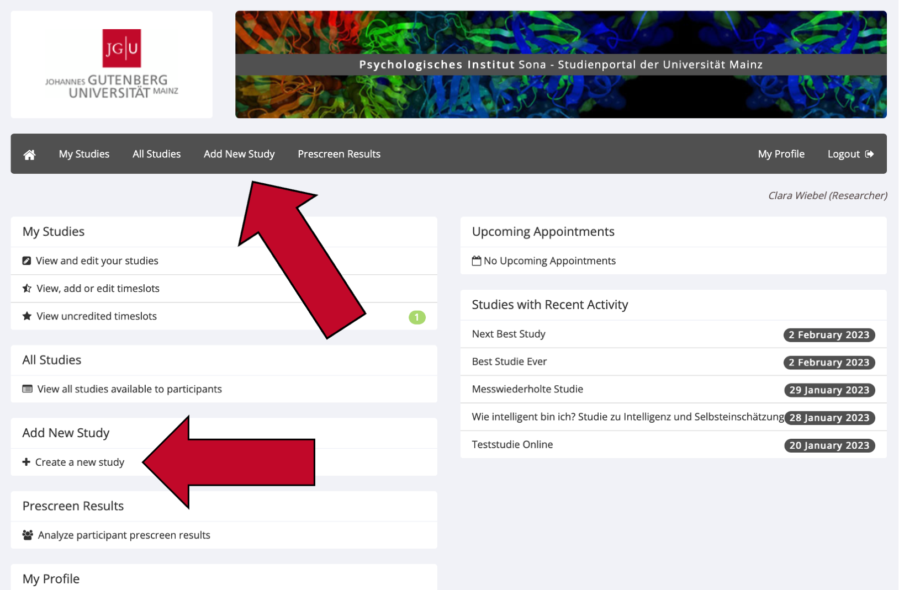
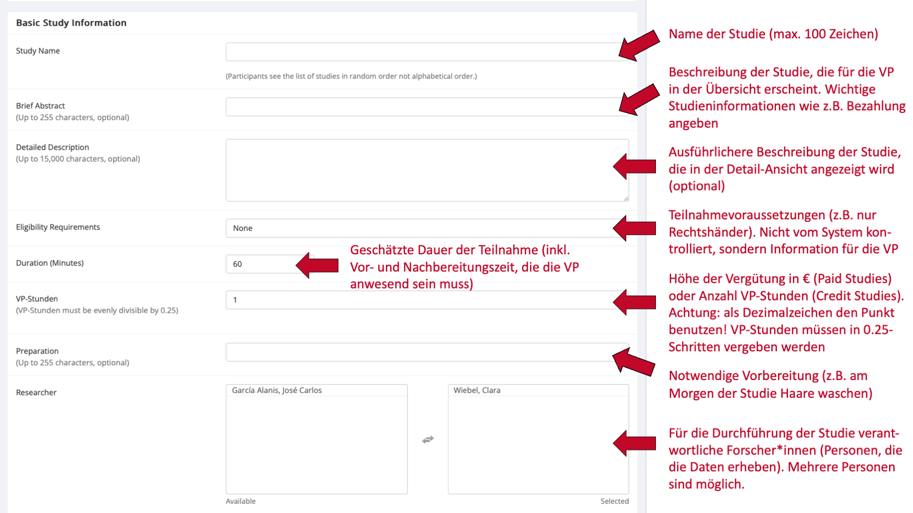
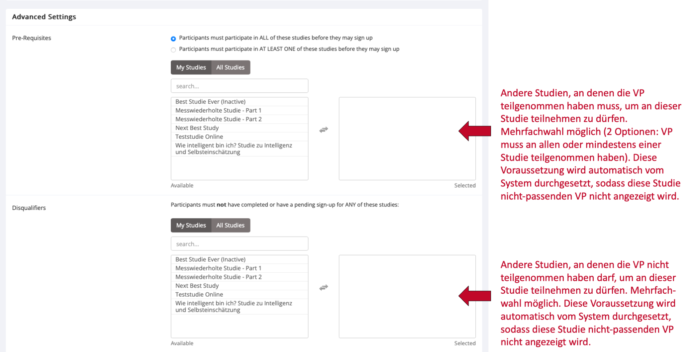
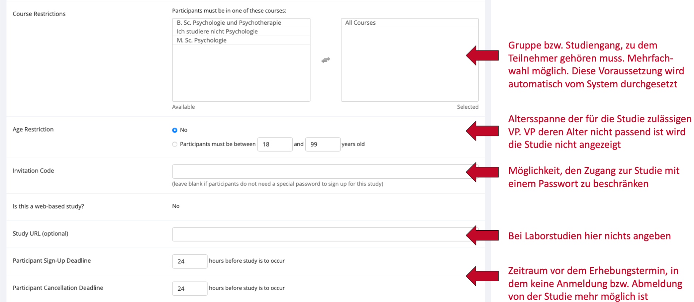

--- 
title: "Sona Researcher Handbuch"
author: "Clara Wiebel"
date: "`r Sys.Date()`"
site: bookdown::bookdown_site
documentclass: book
bibliography: [packages.bib]
url: https://amd-lab.github.io/sona-researcher-jgu/index.html
# cover-image: path to the social sharing image like images/cover.jpg
description: "Dies ist das Researcher-Handbuch für Sona Systems des psychologischen Instituts der JGU Mainz"
link-citations: yes
github-repo:  AMD-Lab/sona-researcher-jgu
lang: de

---

```{r include=FALSE}
options(width = 60)
options(warning.length = 100)
```


# Allgemeine Informationen

Dies ist das Sona-Handbuch für Forscher*innen. Falls Sie Versuchsperson sind, gelangen Sie hier (Link) zum Sona-Handbuch für Versuchspersonen.

Website: https://uni-mainz-jgu.sona-systems.com


## Was ist Sona und welche Vorteile bietet es?

Sona Systems ist ein Onlineportal, das Forscher\*innen in der Verwaltung von wissenschaftlichen Studien und deren Teilnehmer\*innen unterstützt. Forscher\*innen können über Sona Versuchspersonen rekrutieren, Zeitfenster („Timeslots“) für Studien terminieren und die Teilnahme an Studien mit Versuchspersonen-Stunden (VP-Stunden) vergüten. Dies ist über den Webbrowser oder die Sona App (eingeschränkte Nutzungsfunktionen) möglich. Sie können in Sona Systems sowohl Online-Studien als auch Laborstudien verwalten. Beide Studienformen können zudem als mehrteilige Studien angelegt werden. 


Sona bietet direkten Zugang zu einem großen Pool an möglichen Versuchspersonen. In diesem Pool befinden sich alle Psychologiestudierenden, die derzeit Versuchspersonen-Stunden erwerben müssen, aber auch Studierende andere Fächer und Personen mit einer anderen beruflichen Tätigkeit. Diese Versuchspersonen können bei Bedarf sogar vorselektiert („gescreent“) werden. 


Sona Systems verringert den Arbeitsaufwand erheblich, den Forscher*innen bislang mit der Organisation von Studienterminen und der Vergabe von VP-Stunden per E-Mail hatten. Diese können in Sona Systems nun mit nur einem Mausklick vergeben werden. 


## Wer kann einen Forschenden-Account erhalten?

Nur Mitarbeiter\*innen des Psychologischen Instituts der Johannes-Gutenberg-Universität Mainz können einen Forschenden-Account („Researcher Account“) erhalten. Jede Abteilung besitzt darüber hinaus einen Account für wissenschaftliche Hilfskräfte. Studierende erhalten grundsätzlich keine Forschenden-Accounts, auch nicht für Abschlussarbeiten. Für die Verwaltung von Abschlussarbeiten und ggf. die Vergabe von Versuchspersonen-Stunden (VP-Stunden) ist der\*die jeweilige Betreuer\*in der Abschlussarbeit verantwortlich.


## Wie kann ich meinen Forschenden-Account erhalten?

Nur die Administration kann Forschenden-Accounts in Sona Systems erstellen und verwalten. Falls Sie ein Anrecht auf einen Forschenden-Account haben (sehen Sie hierzu den Abschnitt „Wer kann einen Forschenden-Account erhalten?“ in diesem Handbuch), wenden Sie sich bitte unter [sona@uni-mainz.de](mailto:sona@uni-mainz.de?subject=Frage zu Sona - Researcher) an die Administration.


## Rollen im System

In Sona gibt es zwei Rollen für Foscher\*innen – Researchers und Principal Investigators (P.I.s). Dieses Handbuch gilt für beide Rollen und nutzt deshalb den Sammelbegriff „Forschende“ für beide Rollen. 
Der\*die P.I. kann bei einer Studie prinzipiell dieselben Funktionen ausführen wie ein Researcher. Der Hauptunterschied zwischen einem P.I.- und einem Researcher-Konto besteht darin, dass Researcher die Möglichkeit haben, Routine-E-Mails vom System über ihre Studie zu erhalten. Dies sind z. B. Benachrichtigungen, wenn sich Versuchspersonen für die Studie anmelden oder abmelden. Der\*die P.I. hat keine Möglichkeit, solche E-Mails zu erhalten. Somit sollten Personen, die für die Datenerhebung (insbesondere im Labor) zuständig sind, einen Researcher-Account erhalten, während Projektleiter\*innen  einen P.I. Account erhalten sollten. Für jede Studie muss mindestens ein Researcher und ein P.I. ausgewählt werden. 


## Kann ich die Website auch auf Deutsch sehen?

Nein, für Forscher\*innen ist die Website leider nur auf Englisch verfügbar. Die Website wird den Versuchspersonen aber, sofern nicht anders ausgewählt, auf Deutsch angezeigt.


# Studien einstellen und verwalten

## Studien einstellen

Sona Systems unterscheidet fünf Arten von Studien, wobei jede Art entweder mit VP-Stunden („Credit“) oder mit einer Bezahlung („Paid“; auch Gutscheine o.Ä. möglich) vergütet werden kann. Studien, in denen Teilnehmer\*innen zwischen VP-Stunden und Bezahlung wählen können, werden als „Credit“-Studie angelegt. Die alternative Aufwandsentschädigung wird dann in der Beschreibung der Studie erwähnt. 

-	**Standard Study:** normale Laborstudie (nicht online) 
-	**Multi-Part Standard Study:** normale Laborstudie (nicht online), die aus mindestens zwei Teilen besteht 
-	**Online External Study:** Online-Studie, die auf einer anderen Website durchgeführt wird als Sona (z. B. SoSci Survey, Lab.js usw.). Dies ist bei den meisten Online-Studien der Fall. 
-	**Multi-Part Online External Study:** Online-Studie, die auf einer anderen Website durchgeführt wird als Sona und mehrere Messzeitpunkte hat
-	**Online Internal Survey Study:** Online-Befragung innerhalb von Sona 

<br>
Um Ihre Studie auf Sona einzustellen, gehen Sie folgendermaßen vor.

1.	Loggen Sie sich mit Ihrem Forschenden-Account auf https://uni-mainz-jgu.sona-systems.com ein.
2.	Wählen Sie entweder `Add New Study` im Menüstreifen oder `+ Create a new Study`.

```{r echo = FALSE, out.width='92%', fig.align='center'}

```

3.	Wählen Sie die passende Art von Studie aus und klicken sie auf `Continue`.
4.	Nun geben Sie alle Informationen zu Ihrer Studie ein. Die genauen Erklärungen für die Eingabefelder sind in den folgenden Screenshots aufgeführt. 
5.	Speichern Sie Ihre Eingabe, indem Sie auf den grünen Knopf `Add this Study` klicken. Die Studie wird den Versuchspersonen nur angezeigt, wenn sie sowohl „aktiv“ als auch „approved“ ist. Sie können die Studie selbst auf „aktiv“ setzen, aber nur die Administration kann Ihre Studie genehmigen („approve“). 


```{r echo = FALSE, out.width='92%', fig.align='center'}

```
```{r echo = FALSE, out.width='92%', fig.align='center'}
knitr::include_graphics('images/Folie12.png')
```
```{r echo = FALSE, out.width='92%', fig.align='center'}

```
```{r echo = FALSE, out.width='92%', fig.align='center'}

```
```{r echo = FALSE, out.width='92%', fig.align='center'}
knitr::include_graphics('images/Folie15.png')
```


## Studie auf „active“ setzen und genehmigen lassen

Bitte beachten Sie: Bevor Sie Ihre Studie auf „active“ setzen, sollten Sie die ersten Timeslots für Versuchspersonen eingerichtet haben. Sie können Ihre Studie folgendermaßen auf „active“ setzen und eine Genehmigung durch die Administration beantragen: 

1.	Loggen Sie sich mit Ihrem Forschenden-Account auf https://uni-mainz-jgu.sona-systems.com ein.
2.	Klicken Sie in der Menüleiste auf `My Studies` und klicken Sie auf den Titel der betreffenden Studie.
3.	Wählen Sie im `Study Menu` (entweder oben oder ganz unten auf der Website) den Unterpunkt `Change Study Information` aus.
  a.	Klicken Sie unter `Active Study?` auf „Yes“, um Ihre Studie aktiv zu setzen. 
  b.	Klicken Sie unter `Approved?` auf den Knopf `Send an Approval Request`, um eine Genehmigung Ihrer Studie durch die Administration zu beantragen. 
4.	Klicken Sie auf den grünen Knopf `Save Changes`, um Ihre Änderungen zu speichern.


## Wie nutze ich die Pre-Screen Funktion?

Mit der Pre-Screening Funktion können Sie Versuchspersonen anhand bestimmter Kriterien für die Teilnahme an Ihrer Studie vorselektieren. Versuchspersonen, die nicht für Ihre Studie qualifiziert sind, wird Ihre Studie gar nicht erst in der Liste der verfügbaren Studien angezeigt. Das Ausfüllen des Pre-Screening Fragebogens ist für alle Versuchspersonen auf Sona freiwillig.

1.	Um die Pre-Screen Funktion zu nutzen, müssen Sie zunächst Ihre Studie erstellen. Sehen Sie dazu den Abschnitt „Studien einstellen“ in diesem Handbuch.
2.	Sobald Sie Ihre Studie eingestellt haben, gehen Sie auf die Detailansicht Ihrer Studie (dafür den Namen der Studie unter `My Studies` anklicken).
3.	Klicken Sie oben rechts auf den Knopf `View/Modify Restrictions` 

```{r echo = FALSE, out.width='92%', fig.align='center'}
knitr::include_graphics('images/Folie16.png')
```

4.	Hier sehen Sie alle Pre-Screening Fragen, anhand denen Sie Versuchspersonen vorselektieren können. Klicken Sie nur diejenigen Fragen an, anhand derer Sie Versuchspersonen für Ihre Studie vorselektieren möchten. Klicken danach Sie auf `Set Restrictions`.
5.	Nun können Sie diejenige Antwort auswählen, die Versuchspersonen gewählt haben müssen, um für Ihre Studie zugelassen zu werden. Um sich für die Teilnahme an Ihrer Studie zu qualifizieren, müssen die Teilnehmer für jede Frage eine der von Ihnen ausgewählten Antworten gewählt haben.
6.	Klicken Sie auf `Save Changes`, um Ihre Eingabe zu speichern. Die Vorselektion der Versuchspersonen ist ab diesem Moment aktiv. 


## Timeslots für Studien erstellen und verwalten

Timesslots (Zeitfenster) sind die verfügbaren Zeiten, zu denen eine Versuchsperson an Ihrer Studie teilnehmen kann. Mit Zeitfenstern können Sie ein Datum, eine Uhrzeit, einen Ort, eine maximale Teilnehmerzahl und eine\*n (oder mehrere) Forscher\*innen für eine Sitzung angeben. 

<br>
<b>Timeslots für Laborstudien erstellen</b>

1.	Klicken Sie im Hauptmenü auf `My Studies` und dann auf den Titel Ihrer Studie.
2.	Wählen Sie im Study Menu (ganz oben und ganz unten auf der Seite) den Punkt `View/Administer Time Slots`. 
3.	Klicken Sie oben links auf `Add A Timeslot` oder `Add multiple Timeslots`.

```{r echo = FALSE, out.width='92%', fig.align='center'}
knitr::include_graphics('images/Folie17.png')
```

4.	Füllen Sie alle Felder aus. 
5.	Klicken Sie am Ende auf `Add`, um Ihren Timeslot anzulegen.

Falls Sie die Timeslots aus einer bestimmten Woche kopieren möchten, klicken Sie auf `Add Multiple Timeslots` und scrollen Sie ganz nach unten. Hier können Sie die Timeslots aus einer von Ihnen gewählten Woche in eine neue Woche kopieren.

<br>
<b>Timeslots für Online-Studien erstellen</b>

Wenn Sie eine Online-Studie durchführen, sollten Sie nur einen einzigen Timeslot erstellen. Sehen Sie im Abschnitt „Timeslots für Laborstudien erstellen“, wie Sie zur Verwaltung der Timeslots gelangen. Treffen Sie bei der Erstellung des einen Timeslots folgende Einstellungen:

*	Final Participation Date: Der Tag, bis zu dem Versuchspersonen an Ihrer Studie teilnehmen können 
*	Final Participation Time: Die Uhrzeit, bis zu der Versuchspersonen am letzten Tag an Ihrer Studie teilnehmen können.
*	Max. Number of Participants: Maximale Anzahl an Versuchspersonen, die sich für Ihre Studie anmelden können (maximal 999). 

<br>
<b>Timeslots für eine Studie ändern oder löschen</b>

1.	Klicken Sie im Hauptmenü auf `My Studies` und dann auf den Titel Ihrer Studie.
2.	Wählen Sie im Study Menu (ganz oben und ganz unten auf der Seite) den Punkt `View/Administer Time Slots`. 
3.	Sie sehen nun eine Liste der aktuellen Timeslots. Timeslots, die in der Vergangenheit liegen und für die sich keine Teilnehmer\*innen angemeldet haben, werden nicht angezeigt.
4.	Klicken Sie für den Timeslot, den Sie ändern oder löschen möchten, rechts auf `Modify`.
  a.	Ändern: Ändern Sie die gewünschten Informationen und klicken Sie auf den Knopf `Update Timeslot`. Achtung: Bereits für diesen Timeslot angemeldete Versuchspersonen werden nicht (per E-Mail) über die von Ihnen vorgenommenen Änderungen benachrichtigt. Sie sollten sich daher mit den angemeldeten Versuchspersonen in Verbindung setzen, wenn Sie sie über Ihre Änderungen informieren möchten (sehen Sie hierzu den Abschnitt „Angemeldete Versuchspersonen kontaktieren“ in diesem Handbuch).
  b.	Löschen: Sie können keine Timeslots löschen, für die sich bereits Versuchspersonen angemeldet haben. Dafür müssen Sie zuerst alle bestehenden Anmeldungen für diese Timeslots stornieren (sehen Sie hierzu den Abschnitt Termine absagen/ Versuchspersonen abmelden“ in diesem Handbuch). Klicken Sie danach auf den Knopf `Delete` und bestätigen Sie Ihre Eingabe erneut, um den Timeslot zu löschen.


## Wie lange dauert es, bis meine Studie auf Sona genehmigt („approved“) ist?

Bevor Versuchspersonen Ihre Studie auf Sona angezeigt bekommen, muss die Administration auf Sona die Studie genehmigen („approven“). Im Regelfall sollte dies nicht länger als 48 Stunden dauern.
Sollten Sie jedoch im Ausnahmefall länger als 48 Stunden keine Rückmeldung zu Ihrer Studie erhalten haben, schreiben Sie bitte eine E-Mail an die Administration (sona@uni-mainz.de), dass Sie auf die Genehmigung Ihrer Studie warten. 


## Welche Kriterien spielen bei der Genehmigung meiner Studie eine Rolle?

Ihre Studie wird von der Administration geprüft („approved“), bevor Versuchspersonen sie auf Sona angezeigt bekommen. Hierbei handelt es sich lediglich um eine Überprüfung der angegebenen Informationen, ob beispielsweise die Studiendauer und die Anzahl der vergebenen VP-Stunden übereinstimmen. Wissenschaftliche oder ethische Gesichtspunkte der Studie werden nicht überprüft. 
Bei der Überprüfung der Studie kann es vorkommen, dass Sie von der Administration darum gebeten werden, mehr Informationen zur Studie anzugeben oder bestimmte Einstellungen anzupassen. Dies kann die Genehmigung verzögern. 


## Studieninformationen ändern

Sie können jederzeit Informationen über Ihrer Studie aktualisieren. Bitte beachten Sie, dass einige Informationen je nach Status der Studie nicht mehr veränderbar sind (z.B., wenn sich bereits Versuchspersonen angemeldet haben) oder eine erneuten Genehmigung („approve“) der Studie durch die Administration erfordern.

1.	Loggen Sie sich mit Ihrem Forschenden-Account auf https://uni-mainz-jgu.sona-systems.com ein.
2.	Klicken Sie auf `My Studies` und klicken Sie auf den Titel derjenigen Studie, die sie ändern wollen.
3.	Wählen Sie im `Study Menu` (entweder oben oder ganz unten auf der Website) den Unterpunkt `Change Study Information` aus.
4.	Machen Sie die gewünschten Änderungen und klicken Sie auf den grünen Knopf `Save Changes`, um Ihre Änderungen zu speichern. Falls Sie Informationen in Ihrer Studie ändern, die eine erneute Genehmigung durch die Administration erfordern, können Sie den Antrag wie bereits bei der ersten Genehmigung über das System senden (sehen Sie hierzu den Abschnitt „Studien einstellen“). 


## Studien deaktivieren oder löschen 

<b>Studie deaktivieren</b>

Sie können Ihre Studie auf „inactive“ setzen, sobald sich keine weiteren Versuchspersonen mehr für Ihre Studie anmelden sollen. Bitte deaktivieren Sie Ihre Studien, wenn Ihre Datenerhebung abgeschlossen ist.

1.	Gehen Sie in die Detailansicht der Studie (Namen der Studie anklicken)
2.	Wählen Sie unter „Study Menu“ (entweder oben oder ganz unten auf der Seite) den Unterpunkt `Change Study Information` aus. 
3.	Wählen Sie im Abschnitt `Active Study?` „No“ aus und bestätigen Sie die Änderung mit dem grünen Knopf `Save Changes`.

<br>
<b>Studie löschen</b>

Eine Studie kann nur gelöscht werden, wenn…
*	Keine Versuchspersonen mehr dafür angemeldet sind und 
*	Bisher keine VP-Stunden für die Studie vergeben wurden. Grund dafür: Um im System die geleisteten Versuchspersonenstunden der Studierenden zu verwalten, müssen alle Studien, die dazu beigetragen haben, intakt bleiben. Daher sollten Studien, die mit VP-Stunden vergütet wurden, nicht gelöscht werden, sondern auf „inactive“ gesetzt werden!

1.	Gehen Sie in die Detailansicht der Studie (Namen der Studie anklicken)
2.	Wählen Sie unter „Study Menu“ (entweder oben oder ganz unten auf der Seite) den Unterpunkt `Delete Study` aus. Wenn Sie diesen Unterpunkt nicht in der Menüleiste sehen, sind entweder noch Versuchspersonen für diese Studie angemeldet oder es wurden für diese Studie bereits VP-Stunden vergeben. 
3.	Sie werden nun zu den Einstellungen der Studie weitergeleitet. Scrollen Sie nach unten und klicken Sie auf den roten Knopf `Yes. Delete`. Danach ist Ihre Studie endgültig gelöscht.


## Wie darf ich für die Teilnahme an meiner Studie werben?

Sona versendet einmal wöchentlich eine automatische E-Mail an Versuchspersonen, in der alle Studien aufgelistet sind, die aktuell für sie in Sona zur Teilnahme verfügbar sind. Wenn Sie darüber hinaus für die Teilnahme an Ihrer Studie werben wollen, gibt es im ersten Stock des psychologischen Instituts in der Binger Straße 14-16 ein schwarzes Brett, an dem Werbung und Plakate für Studien angebracht werden können. Außerdem können Sie natürlich weiterhin über soziale Medien, lokale Zeitungen oder Flyer für die Teilnahme an Ihren Studien werben.

Auf Sona helfen oft ein kreativer Name sowie eine informative und originelle Beschreibung der Studie, um Teilnehmer\*innen auf Ihre Studie aufmerksam zu machen. Bitte verwenden Sie jedoch keine Sonderzeichen (!!!\*\*\*###) oder CAPSLOCK im Titel Ihrer Studie. Die angezeigte Reihenfolge der Studien wird bei jedem Login für die Versuchspersonen neu randomisiert.

Bitte sehen Sie ferner davon ab, Werbung für Ihre Studie über den E-Mail-Verteiler der Fachschaft zu senden. Dies ist nicht erwünscht, da der Verteiler fortan ausschließlich für Fachschafts-Inhalte genutzt wird. Eine Missachtung führt dazu, dass Ihre E-Mail-Adresse für den Verteiler blockiert wird. 


```{r include=FALSE}
# automatically create a bib database for R packages
knitr::write_bib(c(
  .packages(), 'bookdown', 'knitr', 'rmarkdown'
), 'packages.bib')
```
